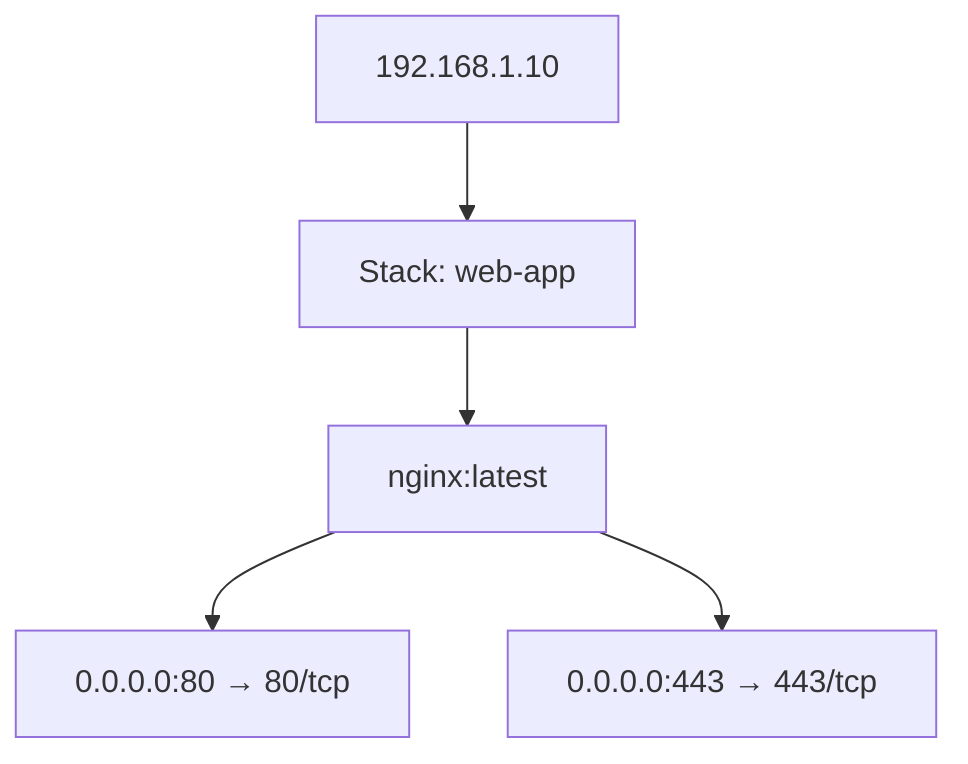

# Docker Infrastructure Mapper

SSH into multiple servers, discover running Docker containers, and generate Mermaid diagrams or HTML tables for documentation.

[](https://www.python.org/downloads/)
[](https://opensource.org/licenses/MIT)

## Quick Start

```bash
git clone https://github.com/vvv850/infra-mapper.git
cd infra-mapper
python -m venv venv
source venv/bin/activate   # Linux/macOS
# or: venv\Scripts\activate  # Windows
pip install --upgrade pip
pip install -e .
infra-mapper
```

Pre-built binaries (no Python required) are available on the [Releases](https://github.com/vvv850/infra-mapper/releases) page.

## Usage

```
infra-mapper                                 # interactive (defaults to both formats)
infra-mapper --format both                   # Mermaid + HTML
infra-mapper --format mermaid                # Mermaid diagram only
infra-mapper --format html                   # HTML tables only
infra-mapper --config /path/to/servers.yaml  # custom config file
```

### First Run

The tool prompts for server details interactively:

- Hostname/IP, SSH username, port
- Authentication method: `key`, `pass`, or `agent`
  - **key** — path to SSH private key file
  - **pass** — password prompted at runtime (never stored to disk)
  - **agent** — delegates to the system SSH agent (1Password, ssh-agent, Pageant)
- Option to save configuration for future runs

### Subsequent Runs

Saved configurations are reused automatically. Password-auth servers prompt for credentials each time.

## Output Formats

### Mermaid (default)

Generates `infrastructure.md` with a Mermaid graph. Port numbers are clickable links. Renders natively on GitHub, GitLab, VS Code (with Mermaid extension), and Obsidian.



### HTML

Generates `infrastructure.html` with styled tables. All CSS is inline — paste directly into any WYSIWYG editor. Explicit foreground/background colors ensure readability on both light and dark themes. Port numbers are clickable.

## Configuration

Server configs are stored at `~/.infra-mapper/servers.yaml`:

```yaml
servers:
  - hostname: 192.168.1.10
    username: admin
    auth_method: key
    ssh_key_path: /home/user/.ssh/id_rsa
    port: 22

  - hostname: 192.168.1.20
    username: deploy
    auth_method: pass
    port: 22

  - hostname: 192.168.1.30
    username: deploy
    auth_method: agent
    port: 22
```

Delete the file to start fresh, or use `--config` to point to a different location.

## Building from Source

PyInstaller cannot cross-compile. Build on the target OS.

```bash
pip install -e ".[dev]"
python build_executable.py
# Output: dist/infra-mapper (or dist\infra-mapper.exe on Windows)
```

## Troubleshooting

**SSH connection failed / Permission denied**
- Verify key exists and has correct permissions: `chmod 600 ~/.ssh/id_rsa`
- Test manually: `ssh -i ~/.ssh/id_rsa user@host`
- For agent auth: confirm the agent is running and has keys loaded (`ssh-add -l`)

**Docker permission denied**
- The tool uses `sudo` for Docker commands. Ensure your user has sudo access.
- To skip password prompts, add to `/etc/sudoers`: `username ALL=(ALL) NOPASSWD: /usr/bin/docker`

**Docker not found**
- Install Docker on the target server: `sudo apt install docker.io`

## Requirements

- Python 3.10+ (not needed for standalone binaries)
- SSH access to target Linux servers
- Docker installed on target servers
- User with sudo privileges for Docker commands

## License

[MIT](LICENSE)
