# 🐳 Docker Infrastructure Mapper

Automated tool to discover and visualize Docker containers running across multiple Ubuntu servers. Generates beautiful Mermaid diagrams for documentation.

## ✨ Features

- 🔌 **SSH Connection**: Securely connect to multiple servers using SSH keys
- 🔍 **Docker Discovery**: Automatically discover all running Docker containers
- 📦 **Stack Detection**: Identify Docker Compose stacks vs standalone containers
- 🗺️ **Port Mapping**: Extract and display all exposed ports
- 📊 **Mermaid Diagrams**: Generate visual documentation that renders in GitHub, VS Code, and more
- 💾 **Config Persistence**: Save server configurations for quick re-runs
- 🎨 **Beautiful CLI**: Interactive prompts with progress bars

## 📋 Prerequisites

### Python 3.10+

This tool requires **Python 3.10 or higher**. Check if you have Python installed:

```bash
python --version
```

If not installed, choose one of these options:

#### Option 1: Official Python (Recommended)
1. Download from [python.org](https://www.python.org/downloads/)
2. Run the installer
3. ✅ **IMPORTANT**: Check **"Add Python to PATH"** during installation
4. Verify: `python --version`

#### Option 2: Microsoft Store (Windows)
1. Open Microsoft Store
2. Search for "Python 3.12"
3. Click Install
4. Verify: `python --version`

#### Option 3: Package Manager

**Windows (Chocolatey):**
```bash
choco install python
```

**Windows (Scoop):**
```bash
scoop install python
```

**macOS (Homebrew):**
```bash
brew install python@3.12
```

**Linux (Ubuntu/Debian):**
```bash
sudo apt update
sudo apt install python3.12 python3.12-venv python3-pip
```

### Server Requirements

- ✅ SSH access to target Ubuntu 24 servers
- ✅ SSH private key authentication configured
- ✅ Docker installed on target servers
- ✅ User account must have `sudo` privileges for Docker commands

## 🚀 Installation

### 1. Clone or Download

```bash
cd "d:\Storage Spaces\Infra Mapping"
```

### 2. Create Virtual Environment

```bash
python -m venv venv
```

### 3. Activate Virtual Environment

**Windows (Git Bash/WSL):**
```bash
source venv/Scripts/activate
```

**Windows (CMD):**
```cmd
venv\Scripts\activate
```

**Windows (PowerShell):**
```powershell
venv\Scripts\Activate.ps1
```

**Linux/macOS:**
```bash
source venv/bin/activate
```

### 4. Install Dependencies

```bash
python -m pip install --upgrade pip
pip install -e .
```

## 📖 Usage

### First Run

Simply run the tool and follow the interactive prompts:

```bash
infra-mapper
```

You'll be asked to provide:
1. **SSH private key path** (default: `~/.ssh/id_rsa`)
2. **For each server:**
   - Hostname or IP address
   - SSH username
   - SSH port (default: 22)
3. **Save configuration** for future runs (recommended)

### Example Session

```
Infrastructure Mapper

Server Configuration
Enter details for each server (leave hostname empty to finish)

Server 1 hostname/IP: 192.168.1.10
SSH username [root]: admin
SSH port [22]: 22
SSH private key path [~/.ssh/id_rsa]: ~/.ssh/my_key
✓ Added 192.168.1.10

Server 2 hostname/IP: prod-server.example.com
SSH username [root]: deploy
SSH port [22]: 22
SSH private key path [~/.ssh/id_rsa]: ~/.ssh/prod_key
✓ Added prod-server.example.com

Server 3 hostname/IP:

Save server configuration for future use? [Y/n]: Y
Configuration saved

╭─────────────────────────────────────────────────────────╮
│              Configured Servers                         │
├────────────────────────┬─────────┬──────┬──────────────┤
│ Hostname               │ Username│ Port │ SSH Key      │
├────────────────────────┼─────────┼──────┼──────────────┤
│ 192.168.1.10          │ admin   │ 22   │ ~/.ssh/...   │
│ prod-server.example.com│ deploy  │ 22   │ ~/.ssh/...   │
╰────────────────────────┴─────────┴──────┴──────────────╯

Discovering containers...
━━━━━━━━━━━━━━━━━━━━━━━━━━━━━━━━━━━━━━━━ 100% 2/2 servers

Discovery Summary

● 192.168.1.10: 2 stacks, 1 standalone, 8 total containers
● prod-server.example.com: 3 stacks, 0 standalone, 12 total containers

Generating Mermaid diagram...

✓ Diagram saved to infrastructure.md
```

### Subsequent Runs

If you saved your configuration, the tool will offer to reuse it:

```bash
infra-mapper

Found saved configuration. Use it? [Y/n]: Y
```

## 📊 Output

The tool generates a `infrastructure.md` file with a Mermaid diagram showing:

- 🖥️ **Servers** (blue nodes)
- 📦 **Docker Compose Stacks** (orange nodes)
- 🐳 **Containers** (green nodes)
- 🔌 **Port Mappings** (pink nodes)

### Example Diagram

```mermaid
graph TB
    server1[🖥️ 192.168.1.10]
    server1 --> stack1[📦 Stack: web-app]
    stack1 --> nginx[🐳 nginx:latest]
    nginx --> port1[🔌 0.0.0.0:80 → 80/tcp]
    nginx --> port2[🔌 0.0.0.0:443 → 443/tcp]

    server1 --> standalone1[🐳 redis:alpine]
    standalone1 --> port3[🔌 0.0.0.0:6379 → 6379/tcp]
```



The diagram renders beautifully in:
- GitHub (natively)
- VS Code (with Markdown Preview Enhanced extension)
- GitLab
- Obsidian
- Any Markdown viewer with Mermaid support

## ⚙️ Configuration

### Configuration File

Server configurations are saved to `~/.infra-mapper/servers.yaml`:

```yaml
servers:
  - hostname: 192.168.1.10
    username: admin
    ssh_key_path: /home/user/.ssh/id_rsa
    port: 22
  - hostname: prod-server.example.com
    username: deploy
    ssh_key_path: /home/user/.ssh/prod_key
    port: 22
```

You can manually edit this file if needed, or delete it to start fresh.

## 🔧 Troubleshooting

### SSH Connection Issues

**Problem:** `SSH connection failed` or `Permission denied`

**Solutions:**
- Verify SSH key exists: `ls -la ~/.ssh/id_rsa`
- Check key permissions: `chmod 600 ~/.ssh/id_rsa` (Linux/Mac)
- Test manual SSH connection: `ssh -i ~/.ssh/id_rsa user@hostname`
- Ensure SSH key is added to server's `~/.ssh/authorized_keys`

### Docker Permission Issues

**Problem:** `Docker permission denied`

**Solution:**
The tool automatically uses `sudo` for all Docker commands. Ensure your user has sudo privileges:
```bash
sudo docker ps  # Should work without password prompt (or with your password)
```

To avoid password prompts, add to `/etc/sudoers` on target servers:
```
your_username ALL=(ALL) NOPASSWD: /usr/bin/docker
```

### Docker Not Found

**Problem:** `Docker not found on server`

**Solution:**
Install Docker on the target server:
```bash
# Ubuntu 24.04
sudo apt update
sudo apt install docker.io
sudo systemctl start docker
sudo systemctl enable docker
```

### Python Version Issues

**Problem:** `python: command not found` or version too old

**Solution:**
- Check version: `python --version` or `python3 --version`
- Install Python 3.10+ (see Prerequisites section above)
- On some systems, use `python3` instead of `python`

### Mermaid Diagram Not Rendering

**Problem:** Diagram shows as code block instead of rendering

**Solutions:**
- **GitHub**: Should render automatically
- **VS Code**: Install "Markdown Preview Mermaid Support" extension
- **GitLab**: Enable Mermaid in project settings
- **Local viewer**: Use a tool like Typora, Obsidian, or [Mermaid Live Editor](https://mermaid.live/)

## 🎯 Use Cases

- **Documentation**: Generate up-to-date infrastructure diagrams for wikis/docs
- **Onboarding**: Help new team members understand service deployment
- **Audit**: Quick overview of what's running where
- **Planning**: Visualize infrastructure before making changes
- **Compliance**: Document container deployments and port exposures

## 🔮 Future Extensions

The architecture supports easy extension for:
- Container health status indicators
- Resource usage (CPU, memory)
- Volume mount discovery
- Network topology visualization
- Real-time monitoring mode
- JSON/HTML/PlantUML export formats
- Kubernetes support
- Web dashboard

## 📝 License

MIT License

## 🤝 Contributing

Contributions welcome! This tool is designed to be extended and improved.

## 🐛 Issues

Found a bug or have a feature request? Please open an issue on the project repository.

---

Made with ❤️ for infrastructure teams
