# 🐳 Docker Infrastructure Mapper

Automated tool to discover and visualize Docker containers running across multiple servers. Generates beautiful Mermaid diagrams for documentation.

[](https://www.python.org/downloads/)
[](https://opensource.org/licenses/MIT)

## 💡 Why?

When your reverse proxy goes down or your DNS stops resolving, you need to know exactly where each container lives and how to reach it directly. I built this tool to give me a clear map of every Docker container across my servers — which host it's on, and which port is exposed — so I can access any service by IP and port without relying on DNS.

The generated Mermaid diagrams include clickable links on port numbers, so you can jump straight to a running service right from your documentation.

## 🚀 Quick Start

```bash
# Clone the repository
git clone https://github.com/vvv850/infra-mapper.git
cd infra-mapper

# Set up and run
python -m venv venv
source venv/Scripts/activate  # On Windows Git Bash
# or: venv\Scripts\activate    # On Windows CMD
# or: source venv/bin/activate # On Linux/macOS

pip install --upgrade pip
pip install -e .
infra-mapper
```

Or download a standalone binary from the [Releases](https://github.com/vvv850/infra-mapper/releases) page — no Python required!

Follow the interactive prompts to configure your servers and generate your infrastructure diagram!

## ✨ Features

- 🔌 **SSH Connection**: Securely connect to multiple servers using SSH keys or password authentication
- 🔍 **Docker Discovery**: Automatically discover all running Docker containers
- 📦 **Stack Detection**: Identify Docker Compose stacks vs standalone containers
- 🗺️ **Port Mapping**: Extract and display all exposed ports
- 📊 **Mermaid Diagrams**: Generate visual documentation that renders in GitHub, VS Code, and more
- 💾 **Config Persistence**: Save server configurations for quick re-runs
- 🎨 **Beautiful CLI**: Interactive prompts with progress bars

## 📋 Prerequisites

### Python 3.10+

This tool requires **Python 3.10 or higher**. Check if you have Python installed:

```bash
python --version
```

If not installed, choose one of these options:

#### Option 1: Official Python (Recommended)
1. Download from [python.org](https://www.python.org/downloads/)
2. Run the installer
3. ✅ **IMPORTANT**: Check **"Add Python to PATH"** during installation
4. Verify: `python --version`

#### Option 2: Microsoft Store (Windows)
1. Open Microsoft Store
2. Search for "Python 3.12"
3. Click Install
4. Verify: `python --version`

#### Option 3: Package Manager

**Windows (Chocolatey):**
```bash
choco install python
```

**Windows (Scoop):**
```bash
scoop install python
```

**macOS (Homebrew):**
```bash
brew install python@3.12
```

**Linux (Ubuntu/Debian):**
```bash
sudo apt update
sudo apt install python3.12 python3.12-venv python3-pip
```

### Server Requirements

- ✅ SSH access to target Linux servers (Ubuntu, Debian, CentOS, etc.)
- ✅ SSH key or password authentication configured
- ✅ Docker installed on target servers
- ✅ User account with `sudo` privileges for Docker commands

**Note**: While developed primarily for Ubuntu 24.04, the tool should work with any Linux distribution running Docker.

## 🚀 Installation

### 1. Clone the Repository

```bash
git clone https://github.com/vvv850/infra-mapper.git
cd infra-mapper
```

Or download the latest release and extract it.

### 2. Create Virtual Environment

```bash
python -m venv venv
```

### 3. Activate Virtual Environment

**Windows (Git Bash/WSL):**
```bash
source venv/Scripts/activate
```

**Windows (CMD):**
```cmd
venv\Scripts\activate
```

**Windows (PowerShell):**
```powershell
venv\Scripts\Activate.ps1
```

**Linux/macOS:**
```bash
source venv/bin/activate
```

### 4. Install Dependencies

```bash
python -m pip install --upgrade pip
pip install -e .
```

## 📖 Usage

### CLI Options

```bash
infra-mapper                              # Use default config (~/.infra-mapper/servers.yaml)
infra-mapper --config /path/to/servers.yaml  # Use custom config file
```

### Standalone Executable (no Python required)

Download the pre-built binary for your platform from the [Releases](https://github.com/vvv850/infra-mapper/releases) page:

| Platform | Binary |
|----------|--------|
| Windows (x64) | `infra-mapper.exe` |
| Linux (x64) | `infra-mapper` |

Just download, and run — no Python installation needed.

### Building from Source

You can build your own standalone executable. **Note:** PyInstaller cannot cross-compile, so you must build on the target platform (build on Windows for `.exe`, build on Linux for Linux binary).

**Windows:**
```powershell
git clone https://github.com/vvv850/infra-mapper.git
cd infra-mapper
python -m venv venv
venv\Scripts\Activate.ps1
pip install --upgrade pip
pip install -e ".[dev]"
python build_executable.py
# Output: dist\infra-mapper.exe
```

**Linux:**
```bash
git clone https://github.com/vvv850/infra-mapper.git
cd infra-mapper
python3 -m venv venv
source venv/bin/activate
pip install --upgrade pip
pip install -e ".[dev]"
python build_executable.py
# Output: dist/infra-mapper
```

### First Run

Simply run the tool and follow the interactive prompts:

```bash
infra-mapper
```

On first run (no saved configuration), you'll be asked to:
1. **(c)reate** a configuration interactively, or **(t)emplate** to generate an editable file
2. **For each server:**
   - Hostname or IP address
   - SSH username (default: root)
   - SSH port (default: 22)
   - Authentication method: **key** (SSH key) or **password**
   - SSH key path (if key auth) or password (if password auth, masked input)
3. **Save configuration** for future runs (recommended)

**Security**: Passwords are **never** saved to disk. Only the auth method and username are stored. You'll be prompted for passwords each time.

### Example Session

```
Docker Infrastructure Mapper
Discover and visualize Docker containers across servers

No server configuration found.
Would you like to (c)reate one interactively or generate a (t)emplate? [c/t] (c): c

Server Configuration
Enter details for each server (leave hostname empty to finish)

Server 1 hostname/IP: 192.168.1.10
SSH username [root]: admin
SSH port [22]: 22
Authentication method [key/password] (key): key
SSH private key path [~/.ssh/id_rsa]: ~/.ssh/my_key
Added 192.168.1.10 (key auth)

Server 2 hostname/IP: prod-server.example.com
SSH username [root]: deploy
SSH port [22]: 22
Authentication method [key/password] (key): password
Password for deploy@prod-server.example.com: ********
Added prod-server.example.com (password auth)

Server 3 hostname/IP:

Save server configuration for future use? [Y/n]: Y
Configuration saved to ~/.infra-mapper/servers.yaml

 Configured Servers
 Hostname                 Username  Port  Auth      SSH Key
 192.168.1.10             admin     22    Key       ~/.ssh/my_key
 prod-server.example.com  deploy    22    Password  -

Discovering containers...
━━━━━━━━━━━━━━━━━━━━━━━━━━━━━━━━━━━━━━━━ 100% 2/2 servers

Discovery Summary

● 192.168.1.10: 2 stacks, 1 standalone, 8 total containers
● prod-server.example.com: 3 stacks, 0 standalone, 12 total containers

Generating Mermaid diagram...

Diagram saved to infrastructure.md
```

### Subsequent Runs

If you saved your configuration, the tool will offer to reuse it:

```
Found saved configuration with 2 server(s) at ~/.infra-mapper/servers.yaml
Use saved configuration? [Y/n]: Y
Loaded saved configuration

1 server(s) use password authentication.
Password for deploy@prod-server.example.com: ********
```

## 📊 Output

The tool generates a `infrastructure.md` file with a Mermaid diagram showing:

- 🖥️ **Servers** (blue nodes)
- 📦 **Docker Compose Stacks** (orange nodes)
- 🐳 **Containers** (green nodes)
- 🔌 **Port Mappings** (pink nodes)

### Example Diagram

```mermaid
graph TB
    server1[🖥️ 192.168.1.10]
    server1 --> stack1[📦 Stack: web-app]
    stack1 --> nginx[🐳 nginx:latest]
    nginx --> port1[🔌 0.0.0.0:80 → 80/tcp]
    nginx --> port2[🔌 0.0.0.0:443 → 443/tcp]

    server1 --> standalone1[🐳 redis:alpine]
    standalone1 --> port3[🔌 0.0.0.0:6379 → 6379/tcp]
```



The diagram renders beautifully in:
- GitHub (natively)
- VS Code (with Markdown Preview Enhanced extension)
- GitLab
- Obsidian
- Any Markdown viewer with Mermaid support

## ⚙️ Configuration

### Configuration File

Server configurations are saved to `~/.infra-mapper/servers.yaml`:

```yaml
servers:
  # Key-based authentication
  - hostname: 192.168.1.10
    username: admin
    auth_method: key
    ssh_key_path: /home/user/.ssh/id_rsa
    port: 22
  # Password authentication (password is prompted at runtime, never stored)
  - hostname: prod-server.example.com
    username: deploy
    auth_method: password
    port: 22
```

You can manually edit this file, delete it to start fresh, or run `infra-mapper --config /path/to/other.yaml` to use a custom location.

## 🔧 Troubleshooting

### SSH Connection Issues

**Problem:** `SSH connection failed` or `Permission denied`

**Solutions:**
- Verify SSH key exists: `ls -la ~/.ssh/id_rsa`
- Check key permissions: `chmod 600 ~/.ssh/id_rsa` (Linux/Mac)
- Test manual SSH connection: `ssh -i ~/.ssh/id_rsa user@hostname`
- Ensure SSH key is added to server's `~/.ssh/authorized_keys`

### Docker Permission Issues

**Problem:** `Docker permission denied`

**Solution:**
The tool automatically uses `sudo` for all Docker commands. Ensure your user has sudo privileges:
```bash
sudo docker ps  # Should work without password prompt (or with your password)
```

To avoid password prompts, add to `/etc/sudoers` on target servers:
```
your_username ALL=(ALL) NOPASSWD: /usr/bin/docker
```

### Docker Not Found

**Problem:** `Docker not found on server`

**Solution:**
Install Docker on the target server:
```bash
# Ubuntu 24.04
sudo apt update
sudo apt install docker.io
sudo systemctl start docker
sudo systemctl enable docker
```

### Python Version Issues

**Problem:** `python: command not found` or version too old

**Solution:**
- Check version: `python --version` or `python3 --version`
- Install Python 3.10+ (see Prerequisites section above)
- On some systems, use `python3` instead of `python`

### Mermaid Diagram Not Rendering

**Problem:** Diagram shows as code block instead of rendering

**Solutions:**
- **GitHub**: Should render automatically
- **VS Code**: Install "Markdown Preview Mermaid Support" extension
- **GitLab**: Enable Mermaid in project settings
- **Local viewer**: Use a tool like Typora, Obsidian, or [Mermaid Live Editor](https://mermaid.live/)

## 🎯 Use Cases

- **Documentation**: Generate up-to-date infrastructure diagrams for wikis/docs
- **Onboarding**: Help new team members understand service deployment
- **Audit**: Quick overview of what's running where
- **Planning**: Visualize infrastructure before making changes
- **Compliance**: Document container deployments and port exposures

## 🔮 Future Extensions

The architecture supports easy extension for:
- Container health status indicators
- Resource usage (CPU, memory)
- Volume mount discovery
- Network topology visualization
- Real-time monitoring mode
- JSON/HTML/PlantUML export formats
- Kubernetes support
- Web dashboard

## 📝 License

MIT License - feel free to use, modify, and distribute!

## 🤝 Contributing

Contributions are welcome! Here's how to contribute:

1. Fork the repository on [GitHub](https://github.com/vvv850/infra-mapper)
2. Create a feature branch: `git checkout -b feature/amazing-feature`
3. Make your changes and commit: `git commit -m "Add amazing feature"`
4. Push to your fork: `git push origin feature/amazing-feature`
5. Open a Pull Request

**Ideas for contributions:**
- Additional export formats (JSON, HTML, PlantUML)
- Container health status indicators
- Resource usage visualization
- Kubernetes support
- Network topology mapping
- Web dashboard interface

## 🐛 Issues & Support

Found a bug or have a feature request?

- **Report issues**: [Create an issue](https://github.com/vvv850/infra-mapper/issues)
- **Discussions**: Use the issue tracker for questions and ideas
- **Documentation**: Improvements to docs are always welcome!

## 🔗 Links

- **Repository**: https://github.com/vvv850/infra-mapper
- **Issue Tracker**: https://github.com/vvv850/infra-mapper/issues
- **Mermaid Docs**: https://mermaid.js.org/

---

Made with ❤️ for infrastructure teams by [vlad](https://github.com/vvv850)
